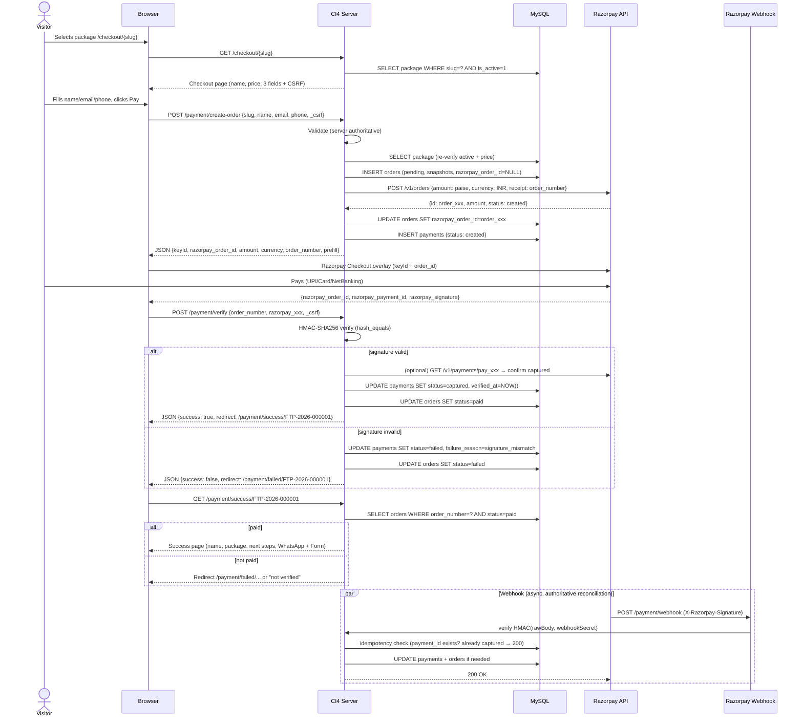

# FTPRENEUR — Payment Flow

> **Provider:** Razorpay — One-time payments only (Orders API + Checkout + Signature Verification)  
> **Invariant:** Browser never decides price or success. Server is authoritative.

---

## 1. High-Level Sequence



---

## 2. Step-by-Step (Authoritative)

### 2.1 Checkout Page

- Route: `GET /checkout/{slug}`
- Server: `PackageService->getActiveBySlug($slug)` — if null → 404 (not 500, not empty price).
- Render: package name, snapshot-able fields, `selling_price` formatted, feature list, checkout form (name, email, phone), CSRF token.
- **No `amount` hidden field as source of truth** — if present for UX, server ignores it.

### 2.2 Create Local Order + Razorpay Order

- Route: `POST /payment/create-order` (AJAX, JSON or form POST → JSON response)
- CSRF + throttle (10/min/IP) + validation:

| Field | Validation |
|-------|------------|
| `slug` | `alpha_dash`, exists, `is_active=1` |
| `customer_name` | 2–100 chars, unicode letters/spaces |
| `customer_email` | valid_email, max 190 |
| `customer_phone` | 10-digit IN mobile `^[6-9]\d{9}$` (strip `+91`/`0` prefix) |

- Transaction:

```php
DB::transStart();
  $pkg = SELECT ... FOR UPDATE?  (not needed — price read is snapshot; no lock)
  $orderNumber = OrderService->generateOrderNumber(); // via order_sequences row lock
  INSERT INTO orders (order_number, package_id, snapshots..., customer_*, currency, subtotal, total_amount, status=pending)
  $rpayOrder = RazorpayService->createOrder([
    'amount'   => (int) round($total_amount * 100), // paise, integer
    'currency' => 'INR',
    'receipt'  => $orderNumber,
    'notes'    => ['package_slug' => $slug] // no PII in notes
  ]);
  UPDATE orders SET razorpay_order_id = $rpayOrder['id'] WHERE id = $newId;
  INSERT INTO payments (order_id, razorpay_order_id, amount, currency, status='created');
DB::transComplete();
```

- Response to browser (JSON):

```json
{
  "keyId": "rzp_live_xxx",
  "razorpay_order_id": "order_xxx",
  "amount": 599900,
  "currency": "INR",
  "order_number": "FTP-2026-000001",
  "customer": {"name": "...", "email": "...", "contact": "..."}
}
```

- **Security:** `keySecret` never in response. `amount` here is informational; Razorpay will charge the order's amount regardless of what browser sends.

### 2.3 Razorpay Checkout (Browser)

- Browser does:

```js
const options = {
  key: data.keyId,
  order_id: data.razorpay_order_id,
  amount: data.amount,
  currency: data.currency,
  name: "Ftpreneur",
  description: packageName,
  prefill: { name, email, contact },
  theme: { color: "#0a1a3a" }, // midnight navy (indicative)
  handler: function(resp) {
    // resp = {razorpay_order_id, razorpay_payment_id, razorpay_signature}
    fetch("/payment/verify", {
      method: "POST",
      headers: {"Content-Type":"application/json", "X-CSRF-TOKEN": csrf},
      body: JSON.stringify({ order_number: data.order_number, ...resp })
    }).then(...)
  },
  modal: { ondismiss: function(){ /* show "payment cancelled — retry" */ } }
};
new Razorpay(options).open();
```

- **Close/cancel:** `ondismiss` shows inline message with Retry button → re-calls `/payment/create-order` or re-opens Checkout with same `razorpay_order_id` if still pending (optional). New attempt creates new `payments` row.

### 2.4 Server Verification (Critical)

- Route: `POST /payment/verify` — CSRF + throttle (20/min/IP)
- Body: `order_number`, `razorpay_order_id`, `razorpay_payment_id`, `razorpay_signature`
- Steps:

```php
$order = OrderModel->where('order_number', $orderNumber)->first();
if (!$order) throw 404;
if ($order['razorpay_order_id'] !== $postedOrderId) throw 400; // mismatch
// Idempotency: if order already paid + payment already captured → return success idempotently
$existing = PaymentModel->where('razorpay_payment_id', $paymentId)->first();
if ($existing && $existing['status'] === 'captured') {
  return json(['success'=>true, 'redirect'=>"/payment/success/{$orderNumber}"]);
}
try {
  RazorpayService->verifySignature($postedOrderId, $postedPaymentId, $postedSignature);
} catch (SignatureException $e) {
  // mark failed
  PaymentModel->insertOrUpdateFailed(...);
  OrderModel->update($order['id'], ['status'=>'failed']);
  log("signature_fail order={$orderNumber}");
  return json(['success'=>false, 'redirect'=>"/payment/failed/{$orderNumber}"]);
}
// Optional: fetch payment from Razorpay to double-check status=captured and amount matches
$remote = RazorpayService->fetchPayment($paymentId);
if ($remote['status'] !== 'captured' || (int)$remote['amount'] !== (int)($order['total_amount']*100)) {
  // amount mismatch → fail — never trust browser
}
// All good — transaction:
DB::transStart();
  PaymentModel->upsert([
    'order_id'=> $order['id'],
    'razorpay_order_id'=> $postedOrderId,
    'razorpay_payment_id'=> $postedPaymentId,
    'razorpay_signature'=> $postedSignature,
    'amount'=> $order['total_amount'],
    'status'=> 'captured',
    'verified_at'=> now()
  ]);
  OrderModel->update($order['id'], ['status'=>'paid']);
DB::transComplete();
return json(['success'=>true, 'redirect'=>"/payment/success/{$orderNumber}"]);
```

- **Timing-safe:** `hash_equals()` inside `RazorpayService::verifySignature`.
- **Never** set `paid` before this block succeeds.

### 2.5 Success Page (Verification-Gated)

- Route: `GET /payment/success/{order_number}`
- Lookup: `SELECT * FROM orders WHERE order_number = ?`
- If `status !== 'paid'` → redirect to `/payment/failed/{order_number}` with message *"Payment not verified"* or 404 if order not found — **never** show paid state speculatively.
- If `paid` → render:
  - ✅ Success state, customer name (`esc()`), package snapshot, `order_number`
  - Instructions: *“Complete your assessment to help us personalize your plan”*
  - `[Complete Assessment]` → `google_form_url` (from `packages` via `package_id` → lookup, fallback to snapshot-advised URL if package archived; validated URL)
  - `[Continue on WhatsApp]` → `https://wa.me/{number}?text={encoded template}`
    - Template per package: `whatsapp_template` e.g. `Hi Ftpreneur Team, I've purchased {package_name}. Order ID: {order_number} Name: {customer_name} I would like to continue with my onboarding.`
    - Server builds URL, URL-encodes: `urlencode(strtr($template, $replacements))`
  - **Note rendered on page:** *“WhatsApp message is for onboarding only — it does not confirm payment. Your payment is already verified.”*

---

## 3. Webhook Strategy (Recommended, Not Optional for Production Reliability)

### Why webhook

Browser callback can fail due to: user closing tab, network drop, JS error, redirect blocked. Without webhook, that payment is `captured` at Razorpay but remains `pending` locally → support nightmare.

### Design

- Route: `POST /payment/webhook` — **CSRF exempt**, HMAC-verified, idempotent.
- Razorpay Dashboard: configure webhook URL `https://ftpreneur.com/payment/webhook`, secret `webhookSecret` (from `.env`), events: `payment.captured`, `payment.failed`, `order.paid`.
- Handler:

```php
$raw = file_get_contents('php://input');
$sig = $_SERVER['HTTP_X_RAZORPAY_SIGNATURE'] ?? '';
$expected = hash_hmac('sha256', $raw, getenv('razorpay.webhookSecret'));
if (!hash_equals($expected, $sig)) { http_response_code(400); exit; }
$event = json_decode($raw, true);
$paymentId = $event['payload']['payment']['entity']['id'] ?? null;
$orderId   = $event['payload']['payment']['entity']['order_id'] ?? null;
// Idempotency
if (PaymentModel->where('razorpay_payment_id', $paymentId)->where('status','captured')->first()) {
  http_response_code(200); exit; // already processed
}
// Reconcile: find order by razorpay_order_id, update to paid if amount matches and event is captured
```

- **Authoritative rule:**
  - **Immediate UX:** browser callback verification is authoritative for redirecting to success.
  - **Reconciliation:** webhook is authoritative after timeout (if browser callback never arrives, webhook will still mark paid; if both arrive, webhook is idempotent no-op).
- **Retry:** Razorpay retries webhook on non-2xx. Our handler must be idempotent and return 200 quickly (no long DB locks).
- **Logging:** Log `payment_id`, `order_id`, `event` — **not** full payload with secrets.

---

## 4. Idempotency Matrix

| Scenario | What happens | Result |
|----------|--------------|--------|
| User refreshes `/payment/success/FTP-xxx` | Re-reads `orders.status` — no re-verification, no duplicate payment | Idempotent view |
| Browser posts `/verify` twice (double-click) | Second hits `razorpay_payment_id` unique check → already captured → 200 success | No duplicate `paid` |
| Razorpay webhook arrives after browser already marked paid | Idempotency check → already captured → 200 no-op | No double update |
| User re-opens Checkout with same `order_xxx` and pays with different `pay_yyy` | New `payments` row, verification creates new `captured` — but `orders` already `paid` → second is extra? Prevent: `orders.status=paid` → reject new `captured` beyond first; log for manual review | One `captured` per order enforced |
| Network drop between Razorpay and server during `createOrder` | Client gets no `order_xxx` → retry creates **new** local order (new `order_number`) + new Razorpay order — old Razorpay order (if created) remains `created` but unlinked; cron/webhook can reconcile or expire | No money lost; orphan Razorpay order is harmless |
| User pays but closes tab before `/verify` | Browser never calls verify → order stays `pending` → webhook arrives → marks `paid` → success page accessible on next visit via order lookup or email (future) | Eventually consistent |

**Enforcement:** `UNIQUE(razorpay_payment_id)`, transaction around `payments`+`orders` update, `hash_equals`, status checks before update.

---

## 5. Failure & Retry Handling

| Failure | User sees | System does |
|---------|-----------|-------------|
| Checkout form validation fail | Inline errors (client + server) | No order created |
| Package inactive / slug invalid | 404 with CTA to packages | No order |
| Razorpay API down on `createOrder` | “Payment service unavailable — retry in a moment” + Retry button | Log, no order marked paid, local order remains `pending` (or not created if before insert) |
| User closes Razorpay overlay | Inline: “Payment cancelled — you can retry” | No verify call; order stays `pending`; Retry re-opens or recreates |
| Signature mismatch | `/payment/failed/{order_number}` with “Verification failed — contact support with Order ID” | Mark `failed`, log, do **not** mark paid |
| Amount mismatch (Razorpay amount ≠ order total) | Same failed page | Mark `failed` — critical alert |
| Payment failed at Razorpay (insufficient funds) | Failed page with Retry (new `payments` attempt) | `payments.status=failed`, `orders.status=failed` (or stays `pending` until retry — decide: set `failed` to allow retry logic; either is fine if documented) |
| Duplicate webhook | 200 no-op | Idempotent |
| Order not found on success URL | 404 + CTA to home | Log |

**Retry UX:** On any `failed`/`cancelled`, success page is **not** accessible. Provide `[Retry Payment]` → `POST /payment/retry/{order_number}` which creates a new `payments` attempt (or new Razorpay order if previous expired) — not a new local `orders` row unless previous order is `failed` and policy is to create fresh order_number for audit clarity. Document choice: **V1: retry = new Razorpay order on same local order** (keeps `order_number` stable for support), but also **new `payments` row**.

---

## 6. Reconciliation

- Admin Payments list shows `captured` vs `failed` vs `created` — filterable by date.
- Periodic (manual in V1) reconciliation: compare Razorpay Dashboard settled payments vs `payments WHERE status=captured` for the day. Mismatch → investigate.
- Future: `GET /admin/payments/reconcile` that pulls Razorpay `payments` API for a date range and highlights delta — **not V1**.

---

## 7. Security Summary (Payment)

- Price read from DB, never from hidden field.
- `keySecret` never in client.
- `hash_equals` + SDK verification.
- Amount integer paise conversion centralized in `RazorpayService`.
- Webhook HMAC verified with raw body.
- Idempotency via unique constraints + status guards.
- Success page gated by `orders.status = paid`.

---

## 8. What Is NOT Implemented in Phase 0

- No SDK calls, no keys, no Checkout JS — only this document.
- No Razorpay webhook registration — only architecture.
- No real order creation code.

> Next phase that implements payments must add: `RazorpayService`, ` .env.example` entries, `Config\Razorpay`, migration indexes for `razorpay_*`, throttle filter, webhook route (CSRF-exempt), and tests for signature mismatch/amount mismatch/idempotency.

